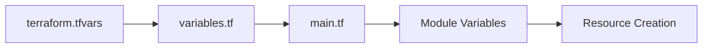
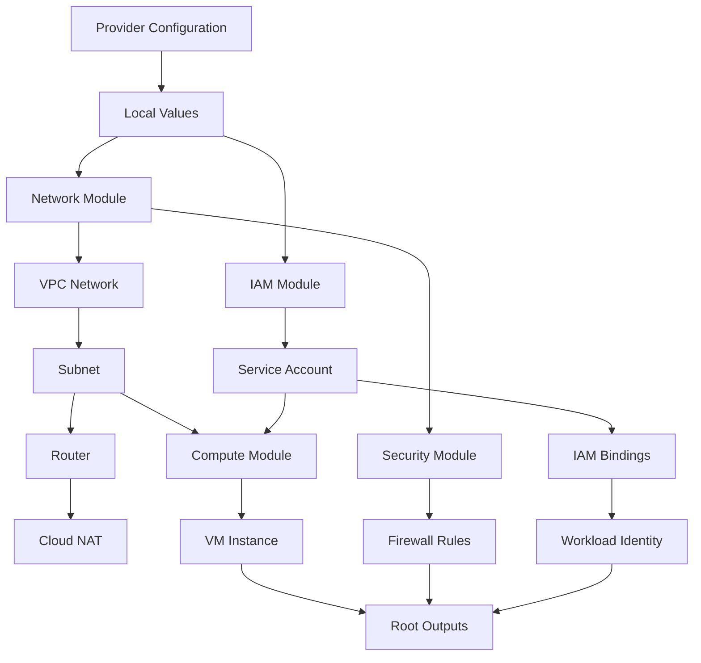

# 🔄 Terraform Code Flow & Data Dependency Guide

**Author**: Suraj Kumar

## 📋 Table of Contents
1. [Overview](#overview)
2. [File Structure & Dependencies](#file-structure--dependencies)
3. [Data Flow Analysis](#data-flow-analysis)
4. [Module Interaction Patterns](#module-interaction-patterns)
5. [Variable Propagation](#variable-propagation)
6. [Resource Creation Order](#resource-creation-order)
7. [Troubleshooting Flow Issues](#troubleshooting-flow-issues)

---

## 🎯 Overview

This guide explains how Terraform files interact, how data flows between modules, and the exact order of resource creation in our GCP infrastructure project.

### Key Concepts
- **Root Module**: Main entry point (`main.tf`, `variables.tf`, `outputs.tf`)
- **Child Modules**: Reusable components (`modules/network`, `modules/compute`, etc.)
- **Data Flow**: How variables and outputs move between files
- **Dependencies**: Which resources depend on others

---

## 📁 File Structure & Dependencies

### Root Level Files
```
├── main.tf                    # 🎯 Orchestrates all modules
├── variables.tf               # 📥 Input variable definitions
├── outputs.tf                 # 📤 Aggregates module outputs
├── terraform.tfvars.example   # 📋 Example configuration
└── environments/
    └── dev/
        └── terraform.tfvars   # 🔧 Environment-specific values
```

### Module Structure (Each module follows same pattern)
```
modules/
├── network/
│   ├── main.tf       # 🏗️ Resource definitions
│   ├── variables.tf  # 📥 Module input variables
│   └── outputs.tf    # 📤 Module outputs
├── security/
│   ├── main.tf       # 🛡️ Firewall rules
│   ├── variables.tf  # 📥 Security variables
│   └── outputs.tf    # 📤 Security outputs
├── iam/
│   ├── main.tf       # 👤 Service accounts & IAM
│   ├── variables.tf  # 📥 IAM variables
│   └── outputs.tf    # 📤 IAM outputs
└── compute/
    ├── main.tf       # 💻 VM instances
    ├── variables.tf  # 📥 Compute variables
    └── outputs.tf    # 📤 Compute outputs
```

---

## 🔄 Data Flow Analysis

### 1. Configuration Input Flow


**Detailed Flow:**
```bash
# Step 1: Environment configuration
environments/dev/terraform.tfvars
├── project_id = "praxis-gear-483220-k4"
├── region = "us-central1"
├── environment = "dev"
└── machine_type = "e2-medium"

# Step 2: Variable definitions
variables.tf
├── Defines variable types and defaults
├── Validates input values
└── Provides descriptions

# Step 3: Root module orchestration
main.tf
├── Reads variables from terraform.tfvars
├── Passes variables to child modules
├── Manages module dependencies
└── Creates local values
```

### 2. Module Interaction Flow
```yaml
execution_flow:
  phase_1_foundation:
    - file: "main.tf"
      action: "Initialize provider and locals"
      
  phase_2_network:
    - module: "network"
      creates: ["VPC", "Subnet", "Router", "NAT"]
      outputs: ["vpc_name", "subnet_name", "vpc_id"]
      
  phase_3_security:
    - module: "security" 
      depends_on: ["network.vpc_name"]
      creates: ["Firewall rules"]
      
  phase_4_iam:
    - module: "iam"
      creates: ["Service Account", "Workload Identity"]
      outputs: ["service_account_email"]
      
  phase_5_compute:
    - module: "compute"
      depends_on: ["network.subnet_name", "iam.service_account_email"]
      creates: ["VM Instance"]
      outputs: ["vm_external_ip", "ssh_command"]
      
  phase_6_outputs:
    - file: "outputs.tf"
      action: "Aggregate all module outputs"
```

### 3. Variable Propagation Examples

#### Example 1: Project ID Flow
```hcl
# 1. terraform.tfvars
project_id = "praxis-gear-483220-k4"

# 2. variables.tf (Root)
variable "project_id" {
  description = "The GCP project ID"
  type        = string
}

# 3. main.tf (Root)
module "network" {
  source     = "./modules/network"
  project_id = var.project_id  # ← Passes to module
}

# 4. modules/network/variables.tf
variable "project_id" {
  description = "The GCP project ID"
  type        = string
}

# 5. modules/network/main.tf
resource "google_compute_network" "vpc" {
  project = var.project_id  # ← Uses in resource
  name    = "${var.environment}-vpc"
}
```

#### Example 2: Inter-Module Dependencies
```hcl
# Network module output
# modules/network/outputs.tf
output "vpc_name" {
  value = google_compute_network.vpc.name
}

# Root main.tf - passing network output to security module
module "security" {
  source       = "./modules/security"
  network_name = module.network.vpc_name  # ← Inter-module dependency
}

# Security module using network output
# modules/security/main.tf
resource "google_compute_firewall" "allow_ssh" {
  network = var.network_name  # ← Uses network from another module
}
```

---

## 🔗 Module Interaction Patterns

### 1. Network Module (Foundation)
```hcl
# modules/network/main.tf
resource "google_compute_network" "vpc" {
  name                    = "${var.environment}-vpc"
  auto_create_subnetworks = false
  project                 = var.project_id
}

resource "google_compute_subnetwork" "subnet" {
  name          = "${var.environment}-subnet"
  ip_cidr_range = var.subnet_cidr
  network       = google_compute_network.vpc.id  # ← Internal dependency
  project       = var.project_id
}

# Outputs for other modules
output "vpc_name" {
  value = google_compute_network.vpc.name
}
```

### 2. Security Module (Depends on Network)
```hcl
# modules/security/main.tf
resource "google_compute_firewall" "allow_ssh" {
  name    = "${var.environment}-allow-ssh"
  network = var.network_name  # ← Depends on network module output
  project = var.project_id
}
```

### 3. Compute Module (Depends on Network + IAM)
```hcl
# modules/compute/main.tf
resource "google_compute_instance" "vm" {
  name         = "${var.environment}-vm"
  machine_type = var.machine_type
  
  network_interface {
    network    = var.network_name      # ← From network module
    subnetwork = var.subnet_name       # ← From network module
  }
  
  service_account {
    email = var.service_account_email  # ← From IAM module
  }
}
```

---

## 📊 Variable Propagation

### Input Variables Flow
```yaml
variable_flow:
  source: "environments/dev/terraform.tfvars"
  
  propagation_chain:
    1_root_variables:
      file: "variables.tf"
      purpose: "Define and validate input variables"
      
    2_root_main:
      file: "main.tf" 
      purpose: "Distribute variables to modules"
      
    3_module_variables:
      files: ["modules/*/variables.tf"]
      purpose: "Accept variables from root"
      
    4_module_main:
      files: ["modules/*/main.tf"]
      purpose: "Use variables in resources"
```

### Output Variables Flow
```yaml
output_flow:
  source: "Module resources"
  
  collection_chain:
    1_module_outputs:
      files: ["modules/*/outputs.tf"]
      purpose: "Expose module resource attributes"
      
    2_root_main:
      file: "main.tf"
      purpose: "Collect module outputs"
      
    3_root_outputs:
      file: "outputs.tf"
      purpose: "Aggregate and expose final outputs"
      
    4_terraform_state:
      purpose: "Store outputs in state file"
```

### Local Values Processing
```hcl
# main.tf - Local values creation
locals {
  common_tags = {
    environment = var.environment      # ← From input variable
    managed_by  = "terraform"         # ← Static value
    project     = var.project_id      # ← From input variable
    team        = var.team            # ← From input variable
  }
}

# Usage in modules
module "compute" {
  source = "./modules/compute"
  tags   = local.common_tags  # ← Passes processed local values
}
```

---

## ⚡ Resource Creation Order

### Terraform Dependency Graph


### Detailed Creation Sequence
```bash
# Phase 1: Provider and Locals
terraform init
├── Initialize Google provider
├── Download required provider plugins
└── Create local values from variables

# Phase 2: Network Foundation (Parallel where possible)
terraform plan/apply
├── google_compute_network.vpc
├── google_compute_subnetwork.subnet (depends on VPC)
├── google_compute_router.router (depends on VPC)
└── google_compute_router_nat.nat (depends on router)

# Phase 3: Security Layer
├── google_compute_firewall.allow_ssh (depends on VPC)
├── google_compute_firewall.allow_http_https (depends on VPC)
├── google_compute_firewall.allow_internal (depends on VPC)
└── google_compute_firewall.allow_health_check (depends on VPC)

# Phase 4: Identity and Access Management
├── google_service_account.vm_service_account
├── google_project_iam_member.* (depends on service account)
├── google_iam_workload_identity_pool.pool
├── google_iam_workload_identity_pool_provider.github_provider
└── google_service_account_iam_binding.workload_identity_binding

# Phase 5: Compute Resources
└── google_compute_instance.vm (depends on subnet + service account)

# Phase 6: Output Collection
└── Collect and expose all module outputs
```

### Dependency Resolution
```python
# Terraform's internal dependency resolution
dependency_graph = {
    "google_compute_network.vpc": [],
    "google_compute_subnetwork.subnet": ["google_compute_network.vpc"],
    "google_compute_router.router": ["google_compute_network.vpc"],
    "google_compute_router_nat.nat": ["google_compute_router.router"],
    "google_compute_firewall.*": ["google_compute_network.vpc"],
    "google_service_account.*": [],
    "google_compute_instance.vm": [
        "google_compute_subnetwork.subnet",
        "google_service_account.vm_service_account"
    ]
}
```

---

## 🔍 Data Retrieval Patterns

### 1. Resource Attribute References
```hcl
# Direct resource attribute access
resource "google_compute_network" "vpc" {
  name = "my-vpc"
}

resource "google_compute_subnetwork" "subnet" {
  network = google_compute_network.vpc.id  # ← Direct reference
}
```

### 2. Module Output References
```hcl
# Root main.tf
module "network" {
  source = "./modules/network"
}

module "compute" {
  source      = "./modules/compute"
  network_id  = module.network.vpc_id      # ← Module output reference
  subnet_name = module.network.subnet_name # ← Module output reference
}
```

### 3. Variable Interpolation
```hcl
# String interpolation with variables
resource "google_compute_instance" "vm" {
  name = "${var.environment}-${var.application}-vm"  # ← Variable interpolation
  
  labels = {
    environment = var.environment
    team        = var.team
    cost_center = var.cost_center
  }
}
```

### 4. Data Source Usage (External Data Retrieval)
```hcl
# Retrieving external data
data "google_compute_zones" "available" {
  region = var.region
}

resource "google_compute_instance" "vm" {
  zone = data.google_compute_zones.available.names[0]  # ← Data source reference
}
```

---

## 🛠️ Troubleshooting Flow Issues

### Common Dependency Problems

#### 1. Circular Dependencies
```bash
# Problem: Module A depends on Module B, Module B depends on Module A
Error: Cycle: module.a, module.b

# Solution: Break the cycle by restructuring dependencies
# Use data sources or separate the conflicting resources
```

#### 2. Missing Variable Declarations
```bash
# Problem: Variable used but not declared
Error: Reference to undeclared input variable

# Solution: Add variable declaration
variable "missing_var" {
  description = "Description of the variable"
  type        = string
}
```

#### 3. Output Not Available
```bash
# Problem: Referencing output that doesn't exist
Error: Unsupported attribute: module.network.nonexistent_output

# Solution: Check module outputs.tf file
output "vpc_name" {
  value = google_compute_network.vpc.name
}
```

### Debugging Commands
```bash
# View dependency graph
terraform graph | dot -Tpng > graph.png

# Show planned changes with dependencies
terraform plan -out=plan.out
terraform show -json plan.out | jq '.planned_values'

# Validate configuration
terraform validate

# Check variable values
terraform console
> var.project_id
> module.network.vpc_name
```

### Flow Validation Checklist
```yaml
validation_checklist:
  variables:
    - [ ] All required variables declared in variables.tf
    - [ ] Variable types match usage
    - [ ] Default values provided where appropriate
    
  modules:
    - [ ] Module source paths correct
    - [ ] All required module variables provided
    - [ ] Module outputs properly defined
    
  dependencies:
    - [ ] No circular dependencies
    - [ ] Implicit dependencies through resource references
    - [ ] Explicit dependencies using depends_on when needed
    
  outputs:
    - [ ] All necessary outputs exposed
    - [ ] Output values reference correct resources
    - [ ] Sensitive outputs marked appropriately
```

---

## 📈 Performance Optimization

### Parallel Execution
```yaml
terraform_parallelism:
  default_parallelism: 10
  
  parallel_resources:
    - "Firewall rules (independent of each other)"
    - "IAM bindings (independent of each other)"
    - "Multiple VM instances (if no dependencies)"
    
  sequential_resources:
    - "VPC → Subnet → VM"
    - "Service Account → IAM Bindings → VM"
```

### State Management
```hcl
# Remote state configuration for team collaboration
terraform {
  backend "gcs" {
    bucket = "terraform-state-bucket"
    prefix = "terraform/state"
  }
}

# State locking prevents concurrent modifications
# Automatic with GCS backend
```

---

## 🎯 Best Practices Summary

### File Organization
✅ **Do:**
- Keep root files minimal and focused
- Use consistent naming conventions
- Group related resources in modules
- Document variable purposes

❌ **Don't:**
- Put all resources in main.tf
- Use unclear variable names
- Create unnecessary dependencies
- Skip output documentation

### Dependency Management
✅ **Do:**
- Use implicit dependencies through resource references
- Structure modules to minimize dependencies
- Test dependency changes thoroughly
- Document complex dependency chains

❌ **Don't:**
- Create circular dependencies
- Use depends_on unnecessarily
- Ignore dependency order in planning
- Mix resource types inappropriately

### Variable Flow
✅ **Do:**
- Validate input variables
- Use descriptive variable names
- Provide sensible defaults
- Document variable relationships

❌ **Don't:**
- Hardcode values in resources
- Skip variable validation
- Use overly complex variable structures
- Ignore variable precedence rules

---

## 📋 Quick Reference

### File Reading Order
1. `terraform.tfvars` → Input values
2. `variables.tf` → Variable definitions  
3. `main.tf` → Module orchestration
4. `modules/*/variables.tf` → Module inputs
5. `modules/*/main.tf` → Resource creation
6. `modules/*/outputs.tf` → Module outputs
7. `outputs.tf` → Final output aggregation

### Common Commands for Flow Analysis
```bash
# Show configuration
terraform show

# Validate flow
terraform validate

# Plan with detailed output
terraform plan -detailed-exitcode

# Apply with parallelism control
terraform apply -parallelism=5

# Show dependency graph
terraform graph
```

---

**🎯 This guide provides complete understanding of how Terraform files interact, data flows between components, and the exact sequence of resource creation in your GCP infrastructure.**